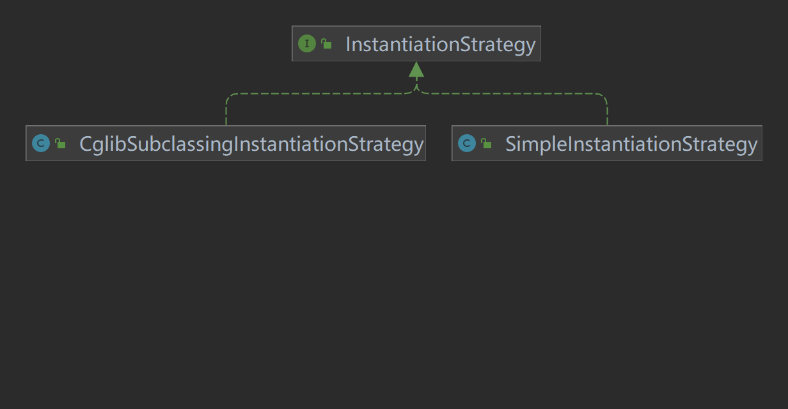

# IOC

## 最简单的bean容器

> 代码分支：simple-bean-container

定义一个简单的BeanFactory，内部包含一个map，用来存储bean的实例。内部只有注册bean和获取bean两个方法

```
public class BeanFactory {

    private final Map<String, Object> beanMap = new HashMap<>();

    public void registerBean(String name, Object bean) {
        beanMap.put(name, bean);
    }

    public Object getBean(String name) {
        return beanMap.get(name);
    }
}
```

测试：

```
public class SimpleBeanContainerTest {

    @Test
    public void testGetBean() {
        BeanFactory beanFactory = new BeanFactory();
        beanFactory.registerBean("helloService", new HelloService());
        HelloService helloService = (HelloService) beanFactory.getBean("helloService");
        String sayHello = helloService.sayHello();
        Assert.assertNotNull(helloService);
        Assert.assertEquals("hello", sayHello);
    }

    static class HelloService {

        public String sayHello() {
            System.out.println("hello");
            return "hello";
        }
    }
}
```

## BeanDefinition和BeanDefinitionRegistry

> 代码分支：bean-definition-and-bean-definition-registry

主要增加如下类：

- BeanDefinition：用来描述bean的定义信息，包含bean的class类型、构造参数、属性值等信息，每个bean对应一个BeanDefinition实例。 简化BeanDefinition仅包含bean的class类型。
- BeanDefinitionRegistry: BeanDefinition注册表接口，定义注册和获取BeanDefinition的方法。
- SingletonBeanRegistry及其实现类DefaultSingletonBeanRegistry，定义注册单例Bean和获取单例bean的方法。

bean容器作为BeanDefinitionRegistry和SingletonBeanRegistry的实现类，具备两者的能力。向bean容器注册BeanDefinition后，使用 bean时才会实例化。


测试：

```
public class BeanDefinitionAndBeanDefinitionRegistryTest {

    @Test
    public void testBeanFactory() {
        DefaultListableBeanFactory beanFactory = new DefaultListableBeanFactory();
        BeanDefinition beanDefinition = new BeanDefinition(HelloService.class);
        beanFactory.registerBeanDefinition("helloService", beanDefinition);

        HelloService helloService = (HelloService) beanFactory.getBean("helloService");
        helloService.sayHello();
    }
}

public class HelloService {

    public String sayHello() {
        System.out.println("hello");
        return "hello";
    }

}

```

## Bean实例化策略InstantiationStrategy

> 代码分支：instantiation-strategy 现在bean是在AbstractAutowireCapableBeanFactory#doCreateBean方法中用beanClass.newInstance()来实例化，仅适用于bean有无参构造函数的情况。


针对bean的实例化，抽象出一个实例化策略的接口InstantiationStrategy，有两个实现类：
- SimpleInstantiationStrategy：使用bean的构造函数来实例化
- CglibSubclassInstantiationStrategy：使用Cglib动态代理来实例化


## 为bean填充属性
> 代码分支：populate-bean-with-property-values

在BeanDefinition中增加Bean属性对应的PropertyValues，实例化bean后，为bean填充属性 AbstractAutowireCapableBeanFactory.applyPropertyValues

测试：
```
public class PopulateBeanWithPropertyValuesTest {

    @Test
    public void testPopulateBeanWithPropertyValues() {
        DefaultListableBeanFactory beanFactory = new DefaultListableBeanFactory();
        PropertyValues propertyValues = new PropertyValues();
        propertyValues.addPropertyValue(new PropertyValue("name", "昂热"));
        propertyValues.addPropertyValue(new PropertyValue("age", "100"));
        beanFactory.registerBeanDefinition("person", new BeanDefinition(Person.class, propertyValues));

        Person person = (Person) beanFactory.getBean("person");
        System.out.println(person);
        Assert.assertEquals("昂热", person.getName());
        Assert.assertEquals(100, person.getAge());
    }

}
```

## 为bean注入bean
> 代码分支：populate-bean-with-bean

增加BeanReference类，包装一个bean对另一个的bean的引用。实例化BeanA后，如果ProperValue#value为BeanReference类型，引用BeanB，则先实例化BeanB，再为BeanA设置属性。
暂不支持循环依赖。

```
protected void applyPropertyValues(String beanName, Object bean, BeanDefinition beanDefinition) {
    try {
        for (PropertyValue propertyValue : beanDefinition.getPropertyValues().getPropertyValueList()) {
            String name = propertyValue.getName();
            Object value = propertyValue.getValue();

            if (Objects.nonNull(value) && value instanceof BeanReference) {
                // beanA依赖beanB，先实例化beanB
                BeanReference beanReference = (BeanReference) value;
                value = getBean(beanReference.getBeanName());
            }

            // 通过反射设置属性值
            BeanUtil.setFieldValue(bean, name, value);
        }
    } catch (Exception e) {
        throw new BeansException("Error setting property values for bean: " + beanName, e);
    }
}
```


测试：
```
public class PopulateBeanWithPropertyValuesTest {

    /**
     * 为bean注入bean
     */
    @Test
    public void testPopulateBeanWithBean() {
        DefaultListableBeanFactory beanFactory = new DefaultListableBeanFactory();

        // 注册Car实例
        PropertyValues propertyValuesForCar = new PropertyValues();
        propertyValuesForCar.addPropertyValue(new PropertyValue("brand", "tesla"));
        BeanDefinition carBeanDefinition = new BeanDefinition(Car.class, propertyValuesForCar);
        beanFactory.registerBeanDefinition("car", carBeanDefinition);


        // 注册Person实例
        PropertyValues propertyValuesForPerson = new PropertyValues();
        propertyValuesForPerson.addPropertyValue(new PropertyValue("name", "昂热"));
        propertyValuesForPerson.addPropertyValue(new PropertyValue("age", 100));
        // Person实例依赖Car实例
        propertyValuesForPerson.addPropertyValue(new PropertyValue("car", new BeanReference("car")));
        beanFactory.registerBeanDefinition("person", new BeanDefinition(Person.class, propertyValuesForPerson));

        Person person = (Person) beanFactory.getBean("person");
        System.out.println(person);

        Assert.assertEquals("昂热", person.getName());
        Assert.assertEquals(100, person.getAge());
        Assert.assertNotNull(person.getCar());
        Assert.assertEquals("tesla", person.getCar().getBrand());

    }

}

```